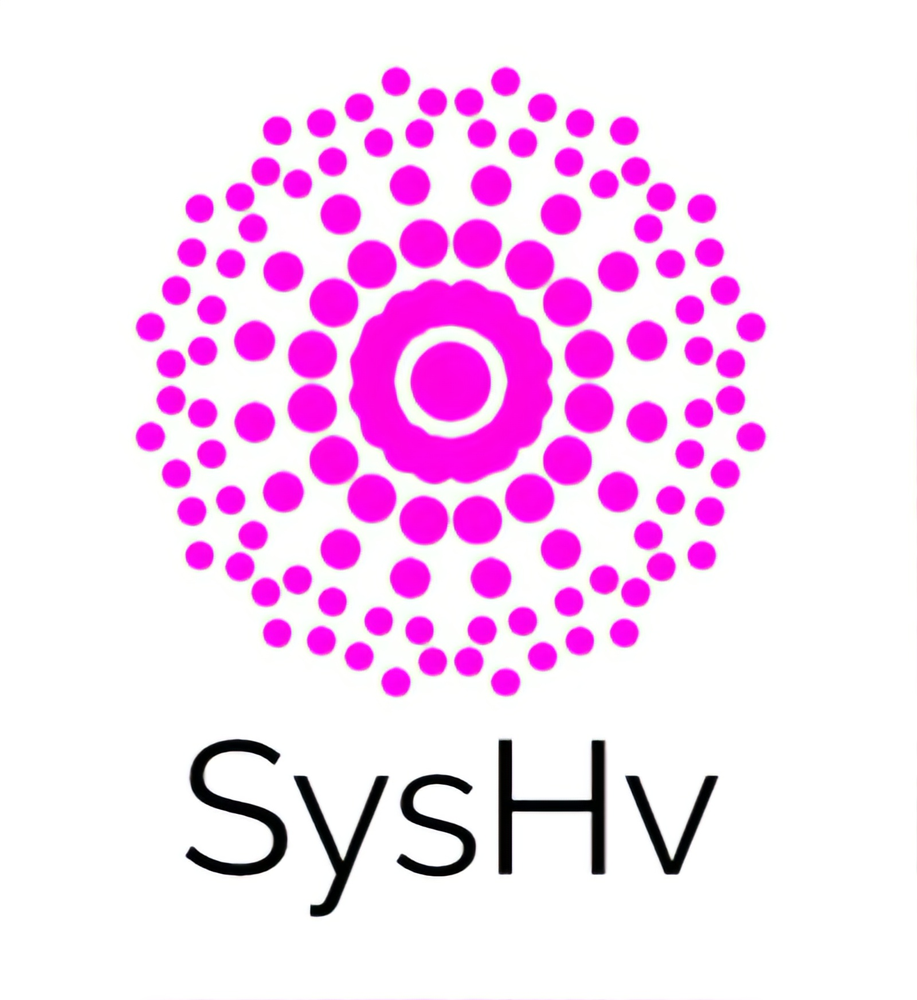

   

   

**SysHv** is an application designed to help system administrator to monitor and manage organization computers. It provides good interface to manage your network computers and monitor their accessibility/statistics in runtime. This application is 6th term project of BSUIR informatics specialization. 

---
### Team
* Andrew Kulikov - github.com/andrew-kulikov
* Arthur Korshunov - github.com/meTur4ik
---
### Technologies
* Language: C# 7.0 (Windows client, admin), Python 3.7 (Linux client)
* Frontend for admin application: WPF
* Windows client: Windows Services
* Database: Mircrosoft SQL Server
* Message transfering: RabbitMQ
---
### Functionality
 * Admin app (web and windows):
    * Desctop application.
    * Can be installed.
    * Consumes messages from all clients.
    * Shows client status (available / unavailabe).
    * Shows client computer description.
    * Shows client computer processes.
    * Shows client computer usage.
    * Uses middleware API layer that processes user data.
    * Has possibility to add custom sensor.
    * Can send notification to client.
* Client app:
    * Is windows service at windows.
    * Is background process at linux.
    * Can be installed.
    * Can configure server address at the moment of installation (maybe after installation).
    * Monitors computer state and parameters.
    * Uses RabbitMQ producer to send messages to the server.
    * Can consume notifications from server.

In future can be added admin app for linux, and phone platforms. That may be possible because of patform independent communication between client and server.
